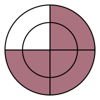
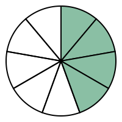

# Progress Clocks

```
usage: progress_clock.py [-h] [--color COLOR] [--size SIZE] [--ring]
                         SECTIONS FILLED

Create a SVG progress clock, used in TTRPGs, such as Blades in the Dark. The
output is the printed to stdout, redirect to a file to save.

positional arguments:
  SECTIONS       Number of sections in the progress clock.
  FILLED         Number of filled sections in the progress clock.

options:
  -h, --help     show this help message and exit
  --color COLOR  Color of the segments in the SVG circle. Default is "#47a".
  --size SIZE    Size of the SVG canvas. Default is 200.
  --ring         Flag to indicate if the progress clock should be a ring.
                 Default is False.
```

`--color` is your standard HTML/CSS RGB representation of color such as 
`#1f4a8f`, `#382a24`, etc.  The leading is "#" is optional, accepts RGB
of length either 3 or 6, so `#9ca` and similar also works.

`--size` is the size of hte canvas, by default this is 200, making it 
larger will create thinner lines, and of course making it smaller will
create thicker lines.  

`--ring` will make the center transparent, so instead of pie shaped, it's 
ring shaped which looks more modern, but both do the same thing. 

```
./progress_clock.py 8 1   >examples/clock-8_1_default.svg
./progress_clock.py 4 3 --size 200 --ring --color "#aa717f"  >examples/clock_4_3_pink_ring.svg
./progress_clock.py 9 4  --color "#8abfa4"  >examples/clock_9_4_8abfa4.svg 
```



